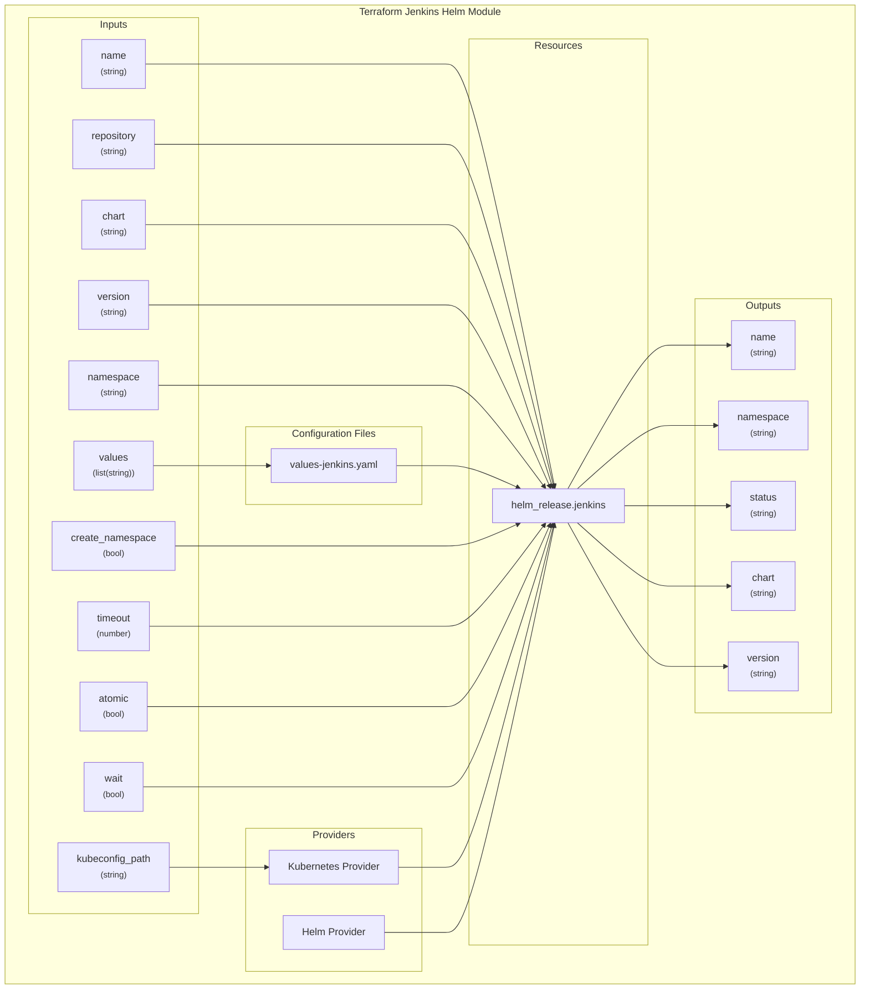
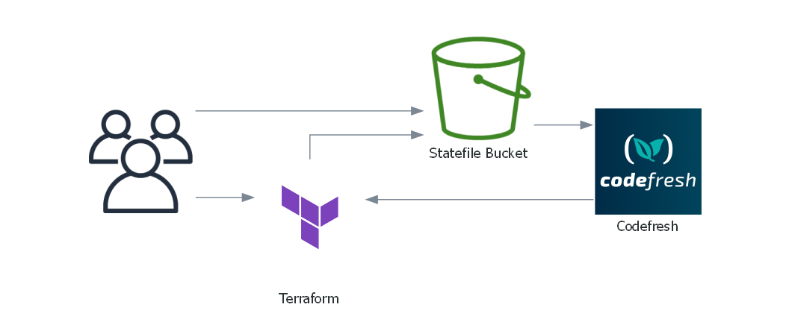

# Terraform Module: terraform-helm-jenkins

[](https://github.com/Richard-Barrett/terraform-helm-jenkins/actions/workflows/iac-codeql.yaml)
[](https://github.com/Richard-Barrett/terraform-helm-jenkins/actions/workflows/terraform_validate.yaml)
[](https://github.com/Richard-Barrett/terraform-helm-jenkins/actions/workflows/tflint.yaml)
[](https://github.com/Richard-Barrett/terraform-helm-jenkins/actions/workflows/trivy.yaml)

A reusable Terraform module to deploy a Jenkins server using the official Jenkins Helm chart.

<details>
<summary>Module Diagram</summary>


</diagram>

## CICD Implementations

Below is an example of a CICD Implementation using BitBucket to call the module and Codefresh to deploy Terraform



## Features

- **Secure Credential Injection:** Safely manage Jenkins admin credentials using Terraform's sensitive variables.
- **Flexible Configuration:** Allow users to pass custom `values.yaml` files or inline configurations.
- **Support for Multiple Environments:** Easily manage different configurations for development, staging, and production.
- **Helm Integration:** Leverage Helm's powerful chart management capabilities for Jenkins deployments.

## Notes

For further nodes, please read [NOTES]()

WARNINGS:
- `Default Secure Values`: This module has a default values settings for passing the default password and username for Jenkins securely via Terraform so you can specify data sources.
- `The file() Function`: Reads the contents of values-jenkins-dev.yaml and passes it to the module.
- `Merging Values`: The module’s internal values-jenkins.tpl.yaml is merged with values-jenkins-dev.yaml. If there are overlapping configurations, values-jenkins-dev.yaml can override the module defaults.
- `jenkins_admin_user`: This variable must be set when invoking this terraform module either via a data source or via Environment Variables.
- `jenkins_admin_password`: This variable must be set when invoking this terraform module either via a data source or via Environment Variables.


### Environment Variables Examples

- i. Using terraform.tfvars

Create a terraform.tfvars file in your environment directory to provide values.

```hcl
# environments/dev/terraform.tfvars
jenkins_admin_user     = "devadmin"
jenkins_admin_password = "SuperSecurePassword!@#"
```

- **Security Note**: Ensure that terraform.tfvars is excluded from version control by adding it to your .gitignore.

gitignore file

```bash
# environments/dev/.gitignore
terraform.tfvars
```

- ii. Using Environment Variables

Terraform automatically picks up variables prefixed with TF_VAR_. You can set them in your shell session.

```bash
export TF_VAR_jenkins_admin_user="devadmin"
export TF_VAR_jenkins_admin_password="SuperSecurePassword!@#"
```

- **Security Note**: Be cautious as environment variables can be exposed through process listings or shell histories. Prefer using environment variables in secure, ephemeral sessions.

- iii. Using a Separate Variables File

Alternatively, use a separate variables file and pass it explicitly during Terraform commands.

```bash
terraform apply -var-file="secure-variables.tfvars"
secure-variables.tfvars:

```hcl
jenkins_admin_user     = "devadmin"
jenkins_admin_password = "SuperSecurePassword!@#"
```

- **Security Note**: Like terraform.tfvars, exclude this file from version control.

## Usage

Below are some usages that you can use to implement the module to deploy Jenkins onto Kubernetes Environments

### Basic Usage

```hcl
module "jenkins" {
  source = "git::https://github.com/Richard-Barrett/terraform-helm-jenkins.git?ref=0.1.0"

  name             = "jenkins"
  repository       = "https://charts.jenkins.io"
  chart            = "jenkins"
  version          = "3.10.1" # Specify the desired chart version
  namespace        = "jenkins"
  create_namespace = true

  values = [
    file("${path.module}/values/jenkins-vaules.yaml")
  ]

  timeout = 600
  atomic  = true
  wait    = true
}
```

### Advanced Usage

```hcl
# environments/dev/main.tf

provider "kubernetes" {
  config_path = "~/.kube/config"
}

provider "helm" {
  kubernetes {
    config_path = "~/.kube/config"
  }
}

module "jenkins" {
  source = "../../modules/terraform-jenkins" # Path to the module

  name             = "jenkins-dev"
  repository       = "https://charts.jenkins.io"
  chart            = "jenkins"
  version          = "3.10.1"
  namespace        = "jenkins-dev"
  create_namespace = true

  # ... other variables

  values = [
    templatefile("${path.module}/values/values-jenkins-dev.tpl.yaml", {
      admin_user     = data.vault_generic_secret.jenkins_dev.data["adminUser"]
      admin_password = data.vault_generic_secret.jenkins_dev.data["adminPassword"]
    }),
    file("${path.module}/values/values-jenkins-extra.yaml")
  ]

  # ... other variables
}
```

in the above you can pass the values for the `admin_user` and the `admin_password`.


### Terraform Documentation

<!-- BEGIN_TF_DOCS -->
## Requirements

| Name | Version |
|------|---------|
| <a name="requirement_terraform"></a> [terraform](#requirement\_terraform) | >= 1.0.0 |
| <a name="requirement_helm"></a> [helm](#requirement\_helm) | >= 2.0.0 |
| <a name="requirement_kubernetes"></a> [kubernetes](#requirement\_kubernetes) | >= 2.0.0 |

## Providers

| Name | Version |
|------|---------|
| <a name="provider_helm"></a> [helm](#provider\_helm) | >= 2.0.0 |

## Modules

No modules.

## Resources

| Name | Type |
|------|------|
| [helm_release.jenkins](https://registry.terraform.io/providers/hashicorp/helm/latest/docs/resources/release) | resource |

## Inputs

| Name | Description | Type | Default | Required |
|------|-------------|------|---------|:--------:|
| <a name="input_atomic"></a> [atomic](#input\_atomic) | If set, the installation process deletes the release on failure. | `bool` | `true` | no |
| <a name="input_chart"></a> [chart](#input\_chart) | The name of the Helm chart to deploy. | `string` | `"jenkins"` | no |
| <a name="input_create_namespace"></a> [create\_namespace](#input\_create\_namespace) | Whether to create the namespace if it does not exist. | `bool` | `true` | no |
| <a name="input_jenkins_admin_password"></a> [jenkins\_admin\_password](#input\_jenkins\_admin\_password) | The admin password for Jenkins. | `string` | n/a | yes |
| <a name="input_jenkins_admin_user"></a> [jenkins\_admin\_user](#input\_jenkins\_admin\_user) | The admin username for Jenkins. | `string` | `"devadmin"` | no |
| <a name="input_kubeconfig_path"></a> [kubeconfig\_path](#input\_kubeconfig\_path) | Path to the Kubernetes configuration file. | `string` | `"~/.kube/config"` | no |
| <a name="input_name"></a> [name](#input\_name) | The name of the Helm release. | `string` | `"jenkins"` | no |
| <a name="input_namespace"></a> [namespace](#input\_namespace) | The Kubernetes namespace to deploy the Helm release into. | `string` | `"jenkins"` | no |
| <a name="input_repository"></a> [repository](#input\_repository) | The Helm chart repository URL. | `string` | `"https://charts.jenkins.io"` | no |
| <a name="input_timeout"></a> [timeout](#input\_timeout) | The maximum time to wait for any individual Kubernetes operation. | `number` | `600` | no |
| <a name="input_values"></a> [values](#input\_values) | A list of values to be passed to the Helm chart. | `list(string)` | `[]` | no |
| <a name="input_version"></a> [version](#input\_version) | The version of the Helm chart to deploy. | `string` | `"3.10.1"` | no |
| <a name="input_wait"></a> [wait](#input\_wait) | If set, will wait until all resources are in a ready state before marking the release as successful. | `bool` | `true` | no |

## Outputs

| Name | Description |
|------|-------------|
| <a name="output_chart"></a> [chart](#output\_chart) | The chart that was deployed. |
| <a name="output_name"></a> [name](#output\_name) | The name of the Helm release. |
| <a name="output_namespace"></a> [namespace](#output\_namespace) | The namespace the Helm release is deployed into. |
| <a name="output_status"></a> [status](#output\_status) | The status of the Helm release. |
| <a name="output_version"></a> [version](#output\_version) | The version of the Helm chart that was deployed. |
<!-- END_TF_DOCS -->
